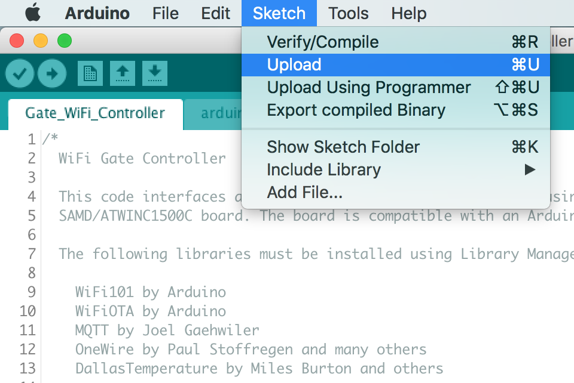

# WiFi Gate Controller Board

This board performs the same functions as my [WiFi Gate Controller](https://github.com/mikelawrence/WiFi-Gate-Controller), which was designed to add WiFi and Home Assistant control to an existing US Automation Gate Opener board, while providing motor control and standard gate inputs. This board will replace a US Automation Gate Opener board. All inputs are now generalized and also support 10k resistor monitoring for safety devices like edge or photoelectric inputs.

This PCB design uses my custom libraries available here [Mike's KiCad Libraries](https://github.com/mikelawrence/KiCad-Libraries).

This PCB was designed with [KiCad 5.1.4](http://kicad-pcb.org).

_Note: Multiple ICs and Modules have exposed pads on the bottom which requires either a reflow oven or hot air to solder properly._

For Bill of Materials generation I use my version of [KiBoM](https://github.com/mikelawrence/KiBoM) forked from [SchrodingersGat](https://github.com/SchrodingersGat/KiBoM).

## Status

* Rev 1.1 PCB has been ordered from PCBWay.
  * Added missing Reference Designators to top Silkscreen.
  * Connected reset input to 3.3V on TCA6424A and TCA6408A. Mistake was assuming reset input had builtin pullup.
  * Added Schottky Diode to input of LED Power Supply.
  * Replaced 1000uF main power capacitor with two 470uF capacitors.
  * Replaced DS18B20 1-Wire temperature sensor with TMP100 I2C temperature sensor.
  * Increased all LED currents to 25mA.
  * Removed U26 inverter and connected U3 IN pin directly to processor. Now able to measure unloaded offset current.
  * You can order parts from Mouser using this [shared BOM](https://www.mouser.com/ProjectManager/ProjectDetail.aspx?AccessID=1331b48340).

* Rev 1.0 PCB was built by and received from PCBWay. Testing has been finished.
  * Debug interface was able to program bootloader.
  * SAMD processor and ATWINC1500 have been programmed and WiFi connectivity verified.
  * DS18B20 temperature sensor verified.
  * I2C interface to TCA6424A, TCA6408A and LPC5024 verified. Reset not connected error found and corrected in Rev 1.1.
  * 12VDC input and reverse polarity protection verified.
  * LED circuitry and power supply verified.
  * All 12 Inputs verified. This includes switch closure and 10k monitoring.
  * All +12V switched outputs verified. Overload tested also.
  * All 2 Normally Open outputs tested.
  * Full-bridge motor control has been tested up to 30A. Far more than needed.
  * Motor current sensing verified.

## Board Preview

## Design

Board size is 5.50" X 6.25". This board is smaller than the standard size of a US Automatic Patriot Board but should match existing spacer locations.

| Terminal | Name  | Conn  | Description                            |
| :---:    | :---: | :---: | :---                                   |
| 01       | +12V  | J3    | +12V power, Always on, PTC fused 0.75A |
| 02       | IN1   | J3    | Input 1 (Radio)                        |
| 03       | IN2   | J3    | Input 2                                |
| 04       | GND   | J3    | Common Ground                          |
| 05       | +12V  | J5    | +12V power, Always on, PTC fused 0.75A |
| 06       | IN3   | J5    | Input 3                                |
| 07       | IN4   | J5    | Input 4                                |
| 08       | GND   | J5    | Common Ground                          |
| 09       | IN5   | J8    | Input 5                                |
| 10       | GND   | J8    | Common Ground                          |
| 11       | IN6   | J8    | Input 6                                |
| 12       | GND   | J8    | Common Ground                          |
| 13       | IN7   | J4    | Input 7                                |
| 14       | GND   | J4    | Common Ground                          |
| 15       | IN8   | J4    | Input 8                                |
| 16       | GND   | J4    | Common Ground                          |
| 17       | IN9   | J6    | Input 9                                |
| 18       | GND   | J6    | Common Ground                          |
| 19       | IN10  | J6    | Input 10                               |
| 20       | GND   | J6    | Common Ground                          |
| 21       | IN11  | J7    | Input 11                               |
| 22       | GND   | J7    | Common Ground                          |
| 23       | IN12  | J7    | Input 12                               |
| 24       | GND   | J7    | Common Ground                          |

### Input Power

### Inputs

There are 12 identical physical inputs on this board. Each input can support Normally Open, Normally Closed, and 10k Monitored Normally Open inputs. A Normally Open input is a dry contact that is open when inactive and closed (shorted) when active. A Normally Closed input is the opposite; closed (shorted) when inactive and open when active. A 10k Monitored input is a Normally Open dry contact with a 8k to 10k resistor across the contacts and is normally used for safety inputs. The resistor allows the connections to the contact to be monitored while inactive. The most current efficient input is the Normally Open input which requires no additional current when inactive. The 10k Monitored input requires an additional 49μA and the Normally Closed input requires a 59μA per input while inactive.

Each input is actually a pair of connections: input and ground (negative terminal of battery). This means the ground side is the same (connected) on all inputs and external wiring must take this into account.

Each input can be configured for different types in software as shown in the table below.

| Input          | Other Names                  | Type     | Monitored | Action |
| :---           | :---                         | :---:    | :---:     | :---   |
| Push Button    |                              | NO       | No        | Cycle through Open/Stop/Close commands to gate. |
| Close          |                              | NO       | No        | While active, close gate and holds it closed. |
| Open           | Exit, Free Exit              | NO       | No        | While active, opens gate and holds it open. |
| Stop           |                              | NC       | No        | While active, stops the gate and holds it in position. |
| Open PhotoEye  |                              | NO or NC | Can be    | While active, stops an opening gate or prevents gate from opening. |
| Close PhotoEye |                              | NO or NC | Can be    | While active, reverses a closing gate to full open and holds it open. |
| Safety Edge    |                              | NO       | Can be    | When activated, stops and momentarily reverses a moving gate. |
| Safety Loop    | Reverse Loop                 | NO       | Can be    | While active, reverses a closing gate to full open and holds it open. |
| Shadow Loop    | Center Loop, Under Gate Loop | NO       | Can be    | While active, prevents a closed gate from opening, prevents an open gate from closing, or reverses a closing gate to fully open and holds it open. |
| Input 1        |                              | NO or NC | Can be    | Has no gate function. Can be used to monitor say a mailbox door.
| Input 2        |                              | NO or NC | Can be    | Has no gate function.

### Outputs

### SAMD ARM Processor and WiFi Module

The ARM processor and ATWINC1500 WiFi module are wired identical to the MKR1000 Arduino board, thus the Arduino development environment is used for software development and the ATWINC1500 module is directly supported.

## Setup

### Arduino Setup

This board is designed to mimic a [MKR1000](https://store.arduino.cc/usa/arduino-mkr1000) board from Arduino. Make sure the the MKR1000 board is supported by installing. Do this by opening the Board Manager as shown below.

Type in "samd" in the filter edit and you will see several options. Select "Arduino SAMD Boards (32-bits ARM Cortex-M0+)" and install the latest version as shown below.

It will take a few minutes to download and install the board package. Once complete it's time to install the necessary libraries. Start by opening the Library Manager as shown below.

Type in "mqtt" in the filter edit and scroll down until you see "MQTT by Joel Gaehwiler" as shown below.

Once "MQTT" is installed repeat the install for the following libraries.

* WiFi101 by Arduino
* WiFiOTA by Arduino
* OneWire by Paul Stoffregen and many others
* DallasTemperature by Miles Burton and others

### Board Setup

The Arduino development environment expects a bootloader in the SAMD ARM processor which will allow programming via USB. The bootloader must be programmed first using a supported programming pod. I used an "Atmel-ICE" pod but there are other options. First make sure you have selected the "Arduino/Genuino MKR1000" board as shown below.

Next select your programmer.

Make sure the board is powered via USB and the programmer is connected to the debug connector then select "Burn Bootloader".

Now the bootloader is programmed it's time to load the "WiFi101 FirmwareUpdater" example. This will update the firmware in the ATWINC1500 module.

Now "Upload" the "WiFi101 FirmwareUpdater" example.

Update the ATWINC1500 module by selecting "WiFi101 Firmware Updater".

Click the "Update Firmware" button.

Finally open the "WiFi_Gate_Controller.ino" sketch downloaded from GitHub. Update the necessary defines for your Wireless network and MQTT server settings see the [Code README](code/README.md) for more information. Now upload it just like the "WiFi101 FirmwareUpdater" example. All done!

## Acknowledgments

[Arduino](www.arduino.cc) kindly develops open source hardware and software which makes writing software for this board and especially the WiFi module easy.
