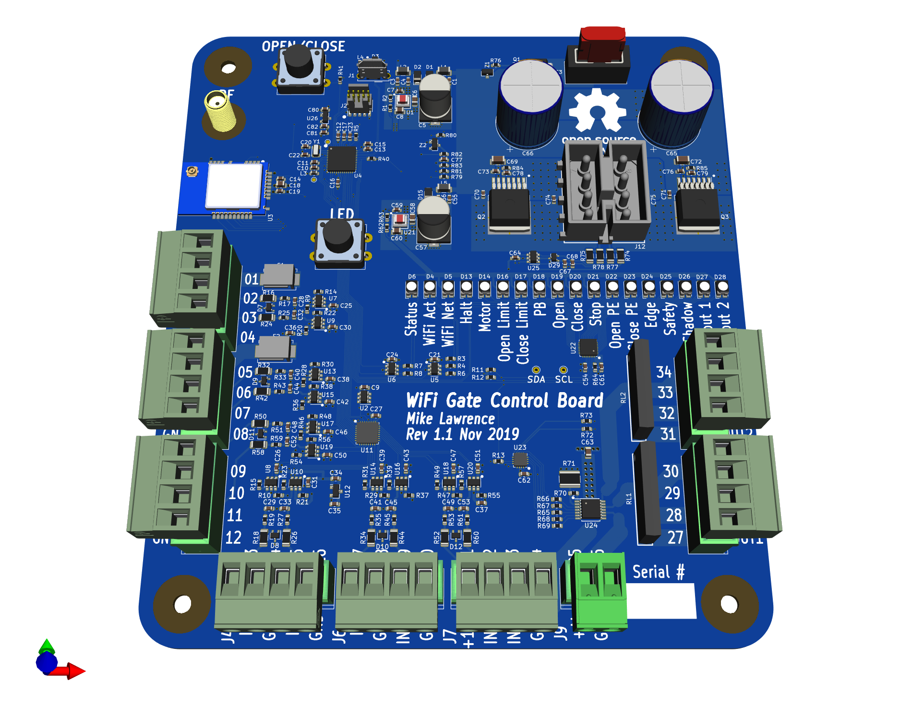

# WiFi Gate Controller Board

This board performs the same functions as my [WiFi Gate Controller](https://github.com/mikelawrence/WiFi-Gate-Controller), which was designed to add WiFi and Home Assistant control to an existing US Automation Gate Opener board, while providing motor control and standard gate inputs. This board will replace a US Automation Gate Opener board. All inputs are now generalized and also support 10k resistor monitoring for safety devices like edge or photoelectric inputs.

This PCB design uses my custom libraries available here [Mike's KiCad Libraries](https://github.com/mikelawrence/KiCad-Libraries).

This PCB was designed with [KiCad 5.1.4](http://kicad-pcb.org).

_Note: Multiple ICs and Modules have exposed pads on the bottom which requires either a reflow oven or hot air to solder properly._

For Bill of Materials generation I use my version of [KiBoM](https://github.com/mikelawrence/KiBoM) forked from [SchrodingersGat](https://github.com/SchrodingersGat/KiBoM).

## Status

* Rev 1.0 PCB has been ordered from PCBWay and has NOT BEEN TESTED.
  * You can order parts from Mouser using this [shared BOM](https://www.mouser.com/ProjectManager/ProjectDetail.aspx?AccessID=1331b48340).
  * You can order the PCB from PCBWay using this [link](https://oshpark.com/shared_projects/meYar6Ji).

## Board Preview

## Design

### Input Power

### Inputs

| Name          | Other Names | Type  | Action |
| :---          | :---        | :---: | :---   |
| Push Button   |             |  N/O  | Cycle through Open/Stop/Close commands to gate |
| Close         |             |  N/O  | Close gate |
| Open          | Exit, Free Exit |  N/O  | Opens gate and holds gate open until released |

### Outputs

### SAMD ARM Processor and WiFi Module

The ARM processor and ATWINC1500 WiFi module are wired identical to the MKR1000 Arduino board, thus the Arduino development environment is used for software development and the ATWINC1500 module is directly supported.

## Setup

### Arduino Setup

This board is designed to mimic a [MKR1000](https://store.arduino.cc/usa/arduino-mkr1000) board from Arduino. Make sure the the MKR1000 board is supported by installing. Do this by opening the Board Manager as shown below.

Type in "samd" in the filter edit and you will see several options. Select "Arduino SAMD Boards (32-bits ARM Cortex-M0+)" and install the latest version as shown below.

It will take a few minutes to download and install the board package. Once complete it's time to install the necessary libraries. Start by opening the Library Manager as shown below.

Type in "mqtt" in the filter edit and scroll down until you see "MQTT by Joel Gaehwiler" as shown below.

Once "MQTT" is installed repeat the install for the following libraries.

* WiFi101 by Arduino
* WiFiOTA by Arduino
* OneWire by Paul Stoffregen and many others
* DallasTemperature by Miles Burton and others

### Board Setup

The Arduino development environment expects a bootloader in the SAMD ARM processor which will allow programming via USB. The bootloader must be programmed first using a supported programming pod. I used an "Atmel-ICE" pod but there are other options. First make sure you have selected the "Arduino/Genuino MKR1000" board as shown below.

Next select your programmer.

Make sure the board is powered via USB and the programmer is connected to the debug connector then select "Burn Bootloader".

Now the bootloader is programmed it's time to load the "WiFi101 FirmwareUpdater" example. This will update the firmware in the ATWINC1500 module.

Now "Upload" the "WiFi101 FirmwareUpdater" example.

Update the ATWINC1500 module by selecting "WiFi101 Firmware Updater".

Click the "Update Firmware" button.

Finally open the "WiFi_Gate_Controller.ino" sketch downloaded from GitHub. Update the necessary defines for your Wireless network and MQTT server settings see the [Code README](code/README.md) for more information. Now upload it just like the "WiFi101 FirmwareUpdater" example. All done!

## Acknowledgments

[Arduino](www.arduino.cc) kindly develops open source hardware and software which makes writing software for this board and especially the WiFi module easy.
