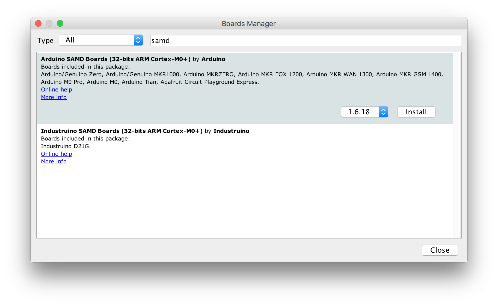
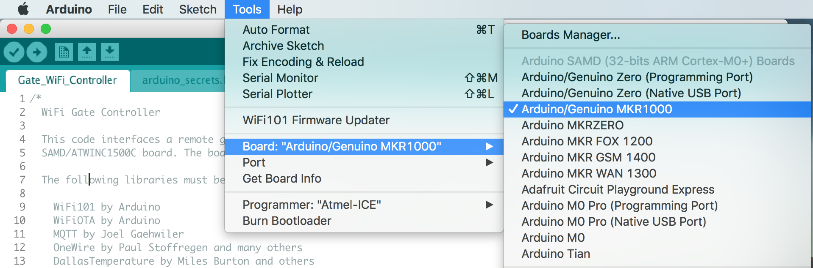
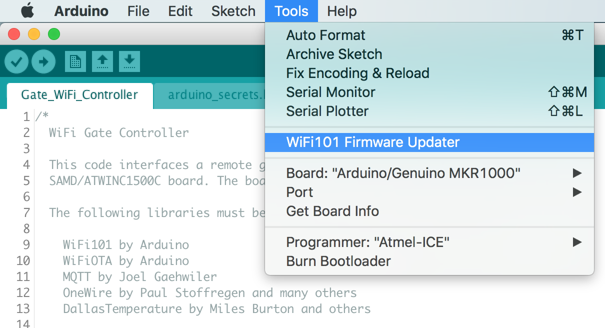

# WiFi Gate Controller Board

This board performs the same functions as my [WiFi Gate Controller](https://github.com/mikelawrence/WiFi-Gate-Controller), which was designed to add WiFi and Home Assistant control to an existing US Automation Gate Opener board, while providing motor control and standard gate inputs. This board will replace a US Automation Gate Opener board. All inputs are now generalized and also support 10k resistor monitoring for safety devices like edge or photoelectric inputs.

This PCB design uses my custom libraries available here [Mike's KiCad Libraries](https://github.com/mikelawrence/KiCad-Libraries).

This PCB was designed with [KiCad 5.1.4](http://kicad-pcb.org).

_Note: Multiple ICs and Modules have exposed pads on the bottom which requires either a reflow oven or hot air to solder properly._

For Bill of Materials generation I use my version of [KiBoM](https://github.com/mikelawrence/KiBoM) forked from [SchrodingersGat](https://github.com/SchrodingersGat/KiBoM).

## Status

* Rev 1.1 PCB was built by and received from PCBWay.
  * This is a 4 layer PCB using 2 oz. copper for all layers and is relatively expensive.
  * Board has been assembled with no problems.
  * Motor interface still needs to be tested everything else is good.
  * You can order PCB from [PCBWay](https://www.pcbway.com/project/shareproject/WiFi_Gate_Control_Board_Rev_1_1.html).
  * You can order parts from Mouser using this [shared BOM](https://www.mouser.com/ProjectManager/ProjectDetail.aspx?AccessID=5c81251866).

* Rev 1.0 PCB was built by and received from PCBWay. Testing is complete.
  * PCBWay built the board.
  * I2C interface to TCA6424A, TCA6408A and LPC5024 verified. Reset not connected error found and corrected in Rev 1.1.
  * 12VDC input and reverse polarity protection verified.
  * LED circuitry and power supply verified.
  * All 12 Inputs verified. This includes switch closure and 10k monitoring.
  * All +12V switched outputs verified. Overload tested also.
  * All 2 Normally Open outputs tested.
  * Full-bridge motor control has been tested up to 30A. Far more than needed.
  * Motor current sensing verified. Removed U26 and connected IN input for each half-bridge directly to processor. Needed to set both half-bridges to active low so MIS offset could be measured unloaded.

## Board Preview

## Design

Intended to replace a US Automatic Patriot Board, this board can directly drive a single gate actuator in both directions. Multiple generic inputs are provided on board to make connection to existing standard gate functionality (open, close, pushbutton...) easy. By providing a WiFi connection to a MQTT server this board can be controlled via standard home automation software (Home Assistant).

Board size is 5.50" X 6.25". This board is smaller than the standard size of a US Automatic Patriot Board but matches existing spacer locations.

### Input Power

The main input connector (J12) provides connections to both the battery and motor. This connector is used by both US Automatic and Apollo gate openers. See pinout below.

A 15 Amp fuse protects the entire board. DC input range is 12V nominal (5V - 17V). Idle input power consumption is pretty variable running from 69mW to 1.38W with an average around 179mW. Peak power is during WiFi transmit.

There are two identical power supplies. U1 powers most of the board via 3.3V. U1's power source is either main power (J12) or the USB connector (J1) so the microprocessor can be programmed on the bench without main power. All LEDs on the board are powered by a separate power supply (U21) which can be turned off by the microprocessor. This substantially reduces power consumption

### Board connections

There are nine screw terminal blocks with removable headers on the board used to connect with all gate functions.

| Terminal | Name  | Conn  | Description                            |
| :---:    | :---: | :---: | :---                                   |
| 01       | +12V  | J3    | +12V power, Always on, fused 0.75A     |
| 02       | IN1   | J3    | Input 1 (Radio)                        |
| 03       | IN2   | J3    | Input 2                                |
| 04       | GND   | J3    | Common Ground                          |
| 05       | +12V  | J5    | +12V power, Always on, fused 0.75A     |
| 06       | IN3   | J5    | Input 3                                |
| 07       | IN4   | J5    | Input 4                                |
| 08       | GND   | J5    | Common Ground                          |
| 09       | IN5   | J8    | Input 5                                |
| 10       | GND   | J8    | Common Ground                          |
| 11       | IN6   | J8    | Input 6                                |
| 12       | GND   | J8    | Common Ground                          |
| 13       | IN7   | J4    | Input 7                                |
| 14       | GND   | J4    | Common Ground                          |
| 15       | IN8   | J4    | Input 8                                |
| 16       | GND   | J4    | Common Ground                          |
| 17       | IN9   | J6    | Input 9                                |
| 18       | GND   | J6    | Common Ground                          |
| 19       | IN10  | J6    | Input 10                               |
| 20       | GND   | J6    | Common Ground                          |
| 21       | IN11  | J7    | +12V power, Switched PhotoEye power    |
| 22       | GND   | J7    | Input 11                               |
| 23       | IN12  | J7    | Input 12                               |
| 24       | GND   | J7    | Common Ground                          |
| 25       | +AL   | J9    | +12V power, Switched Alarm power       |
| 26       | GND   | J9    | Common Ground                          |
| 27       | OUT1  | J7    | Output 1, NO switch Output 1           |
| 28       | COM1  | J7    | Common 1, NO switch Output 1           |
| 29       | GND   | J9    | Common Ground                          |
| 30       | +12V  | J9    | +12V power, Switched Output 1 power    |
| 31       | OUT2  | J7    | Output 2, NO switch Output 2           |
| 32       | COM2  | J7    | Common 2, NO switch Output 2           |
| 33       | GND   | J9    | Common Ground                          |
| 34       | +12V  | J9    | +12V power, Switched Output 2 power    |

### Inputs

There are 12 identical physical inputs on this board. Each input can support Normally Open, Normally Closed, and 10k Monitored Normally Open inputs. A Normally Open input is a dry contact that is open when inactive and closed (shorted) when active. A Normally Closed input is the opposite; closed (shorted) when inactive and open when active. A 10k Monitored input is a Normally Open dry contact with a 8k to 10k resistor across the contacts and is normally used for safety inputs. The resistor allows the connections to the contact to be monitored while inactive. The most current efficient input is the Normally Open input which requires no additional current when inactive. The 10k Monitored input requires an additional 49μA and the Normally Closed input requires a 59μA per input while inactive.

Each input is actually a pair of connections: input and ground (negative terminal of battery). This means the ground side is the same (connected) on all inputs and external wiring must take this into account. Each input can be configured for different gate input types in software as shown in the table below.

| Input          | Other Names                  | Type     | Monitored | Action |
| :---           | :---                         | :---:    | :---:     | :---   |
| Push Button    |                              | NO       | No        | Cycle through Open/Stop/Close commands to gate. |
| Close          |                              | NO       | No        | While active, close gate and holds it closed. |
| Open           | Exit, Free Exit              | NO       | No        | While active, opens gate and holds it open. |
| Stop           |                              | NC       | No        | While active, stops the gate and holds it in position. |
| Open PhotoEye  |                              | NO or NC | Yes       | While active, stops an opening gate or prevents gate from opening. |
| Close PhotoEye |                              | NO or NC | Yes       | While active, reverses a closing gate to full open and holds it open. |
| Safety Edge    |                              | NO       | Yes       | When activated, stops and momentarily reverses a moving gate. |
| Safety Loop    | Reverse Loop                 | NO       | Yes       | While active, reverses a closing gate to full open and holds it open. |
| Shadow Loop    | Center Loop, Under Gate Loop | NO       | Yes       | While active, prevents a closed gate from opening, prevents an open gate from closing, or reverses a closing gate to fully open and holds it open. |
| Input 1        |                              | NO or NC | Yes       | Has no gate function. Can be used to monitor say a mailbox door.
| Input 2        |                              | NO or NC | Yes       | Has no gate function.

Look at [Safety Edge Circuit calculations](drawings/Safety Edge Circuit calculations.pdf) for an explanation of how the input circuits with 10k monitoring work.

### Outputs

There are 4 switched power outputs on the board. J7 is used for PhotoEye connections and thus the +12V is switched on only during gate motion. The Alarm +AL is switched to +12V when alarm is active. The +12V on J10 and J11 output connectors are switched based on output settings.

There are several to be defined output settings here.

### SAMD ARM Processor and WiFi Module

The ARM processor and ATWINC1500 WiFi module are wired identical to the MKR1000 Arduino board, thus the Arduino development environment is used for software development and the ATWINC1500 module is directly supported.

## Setup

### Arduino Setup

This board is designed to mimic a [MKR1000](https://store.arduino.cc/usa/arduino-mkr1000) board from Arduino. Make sure the the MKR1000 board is supported by installing. Do this by opening the Board Manager as shown below.

Type in "samd" in the filter edit and you will see several options. Select "Arduino SAMD Boards (32-bits ARM Cortex-M0+)" and install the latest version as shown below.

It will take a few minutes to download and install the board package. Once complete it's time to install the necessary libraries. Start by opening the Library Manager as shown below.

Type in "mqtt" in the filter edit and scroll down until you see "MQTT by Joel Gaehwiler" as shown below.

Once "MQTT" is installed repeat the install for the following libraries.

* WiFi101 by Arduino
* WiFi101OTA by Arduino
* SD by Arduino
* FreeRTOS_SAMD21 by BriscoeTech
* I2C_DMAC version by Martin Lindupp

### Board Setup

The Arduino development environment expects a bootloader in the SAMD ARM processor which will allow programming via USB. The bootloader must be programmed first using a supported programming pod. I used an "Atmel-ICE" pod but there are other options. First make sure you have selected the "Arduino/Genuino MKR1000" board as shown below.

Next select your programmer.

Make sure the board is powered via USB and the programmer is connected to the debug connector then select "Burn Bootloader".

Now the bootloader is programmed it's time to load the "WiFi101 FirmwareUpdater" example. This will update the firmware in the ATWINC1500 module.

Now "Upload" the "WiFi101 FirmwareUpdater" example.

Update the ATWINC1500 module by selecting "WiFi101 Firmware Updater".

Select the latest WINC1501 firmware and click the "Update Firmware" button.

Finally open the "WiFi_Gate_Controller.ino" sketch downloaded from GitHub. Update the necessary defines for your Wireless network and MQTT server settings see the [Code README](code/README.md) for more information. Now upload it just like the "WiFi101 FirmwareUpdater" example. All done!

This project also supports Visual Studio Code. Visual Studio Code supports building Arduino projects and IntelliSense with code completion. The included settings files support my MacOS environment. Just do a search for "Visual Studio Code Arduino" to see how to install.

## Acknowledgments

[Arduino](www.arduino.cc) kindly develops open source hardware and software which makes writing software for this board and especially the WiFi module easy.
[Visual Studio Code](https://code.visualstudio.com/) from Microsoft is a great alternative to the Arduino IDE.
